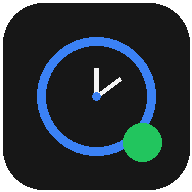

# Shift Calculator

<p align="center">
  
</p>

A shift management app for hourly workers to track work hours, calculate pay (with tax and overtime), and monitor upcoming paydays across multiple workplaces.

## Features

- **Multi-workplace support** — track different jobs with separate pay rates, tax rates, and colors
- **Flexible shift scheduling** — single shifts or weekly schedules with per-day times and breaks
- **Pay calculations** — gross pay, tax deductions, net pay, overtime support
- **Payday tracking** — countdown to next payday with earnings breakdown
- **Calendar view** — month view with shift indicators, tap for details
- **Dark mode** — system-aware theme with manual toggle
- **Google OAuth + Email/Password auth**
- **Cloud database** with local settings cache

## Tech Stack

- **Framework:** Next.js 14 (App Router)
- **Auth:** NextAuth v5 (Google OAuth + Credentials)
- **Database:** Supabase Postgres
- **ORM:** Drizzle ORM
- **UI:** shadcn/ui + Tailwind CSS
- **State:** React hooks + fetch-based API layer

## Getting Started

```bash
npm install --legacy-peer-deps
npm run dev
```

### Environment Variables

Create a `.env` file:

```env
DATABASE_URL=your-supabase-postgres-url
AUTH_SECRET=your-nextauth-secret
GOOGLE_CLIENT_ID=your-google-client-id
GOOGLE_CLIENT_SECRET=your-google-client-secret
```

### Database Setup

```bash
npx drizzle-kit push
```

### Google OAuth Setup

1. Go to [Google Cloud Console](https://console.cloud.google.com/apis/credentials)
2. Create OAuth 2.0 Client ID
3. Add redirect URI: `http://localhost:3000/api/auth/callback/google`
4. Copy Client ID and Secret to `.env`

## Project Structure

```
app/
  api/
    auth/[...nextauth]/   → NextAuth route handler
    auth/register/        → Email/password registration
    workplaces/           → Workplaces CRUD (list + individual)
    shifts/               → Shifts CRUD (list + individual)
    pay-periods/          → Pay periods CRUD
    settings/             → User settings
  layout.tsx              → Root layout (AuthProvider + ThemeProvider)
  page.tsx                → Main app (sidebar nav + tab content)

components/
  auth/auth-form.tsx      → Login/register (Google + email/password)
  workplace-manager.tsx   → Workplace cards + detail view + CRUD
  shift-manager.tsx       → Shift list + single/weekly schedule forms
  calendar-view.tsx       → Month calendar with shift dots/details
  payday-tracker.tsx      → Upcoming payday cards + 30-day summary
  settings-panel.tsx      → Work settings + app preferences
  next-shift-card.tsx     → Countdown to next shift
  ui/                     → shadcn components + date-picker

hooks/
  use-shift-data.ts       → Main data hook (fetch-based, no server imports)

lib/
  auth.ts                 → NextAuth config (Drizzle adapter)
  auth-provider.tsx       → SessionProvider wrapper
  settings-storage.ts     → localStorage read/write for settings
  api/auth-helpers.ts     → API route auth helper
  db/
    index.ts              → Drizzle client
    schema.ts             → DB schema (auth + app tables)
    queries/              → Server-side CRUD functions
```

---

## v1.0 — What's Done

- [x] NextAuth (Google OAuth + email/password credentials)
- [x] Drizzle ORM + Supabase Postgres
- [x] API routes for all CRUD operations (server-side only)
- [x] Multi-workplace management with detail view
- [x] Single shift + weekly schedule creation (per-day times and breaks)
- [x] Shift collision detection
- [x] Pay calculations (gross, tax, net, overtime)
- [x] Payday tracker with earnings breakdown
- [x] Calendar month view (dots on mobile, details on desktop)
- [x] Settings with localStorage cache + DB background sync
- [x] Dark mode (system + manual toggle)
- [x] Mobile sidebar navigation
- [x] Responsive layout (mobile, tablet, desktop)
- [x] DatePicker component (shadcn Calendar + Popover)
- [x] Timezone-safe date handling

## TODO — v2.0

### High Priority

- [ ] **Offline support + localStorage sync layer**
  - Cache shifts/workplaces/pay periods in localStorage
  - Queue offline changes and sync when back online
  - Conflict resolution (last-write-wins)

- [ ] **Re-add PWA infrastructure**
  - Service worker (Serwist or Workbox)
  - Web app manifest
  - Offline fallback page
  - Install prompt + offline indicator

### Medium Priority

- [ ] Export shifts to CSV
- [ ] Shift recurrence (weekly repeating shifts)
- [ ] Auth middleware for route protection
- [ ] Pay calculator tab (component exists but not wired up)
- [ ] Fix `react-day-picker` v8 / `date-fns` v4 version mismatch
- [ ] Loading states on individual CRUD operations
- [ ] Optimistic updates

### Low Priority

- [ ] Error boundaries
- [ ] Remove `ignoreBuildErrors` from next.config and fix TS errors
- [ ] Pay period auto-advancement
- [ ] Multi-timezone support
- [ ] Proper /login page (currently inline in page.tsx)